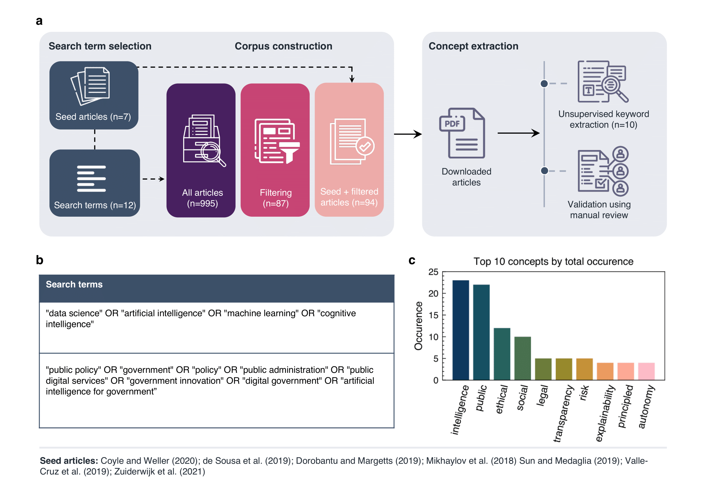
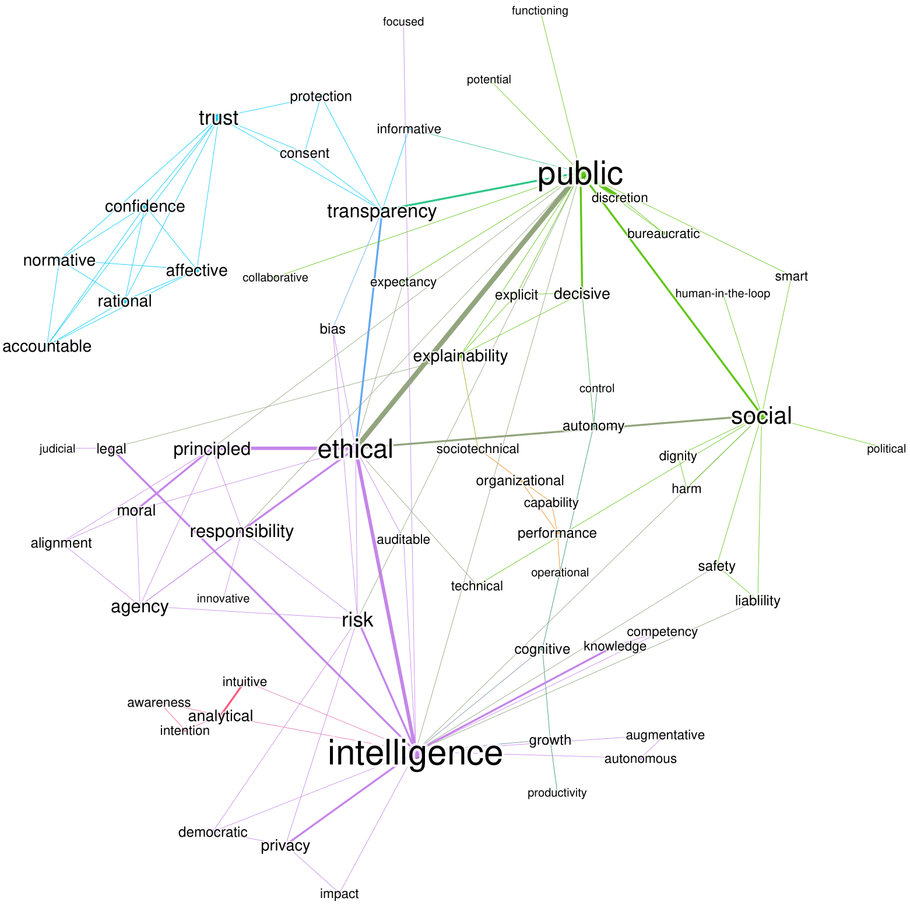
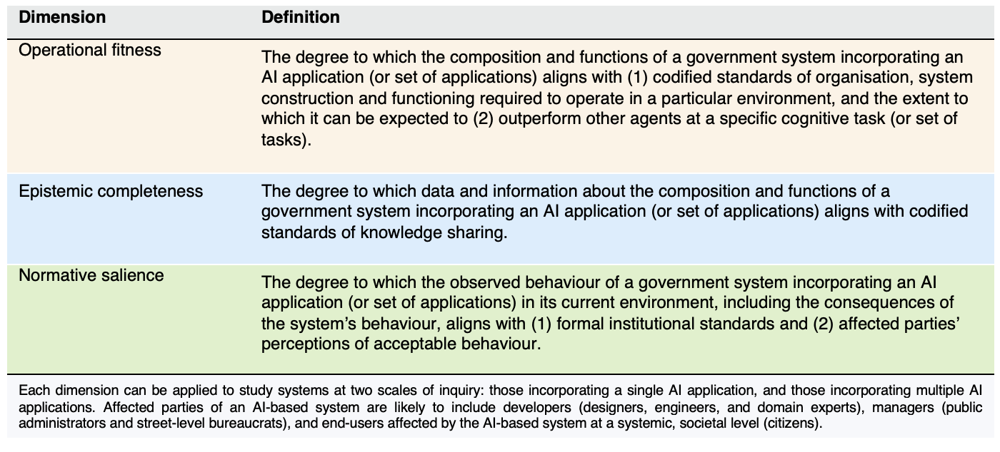
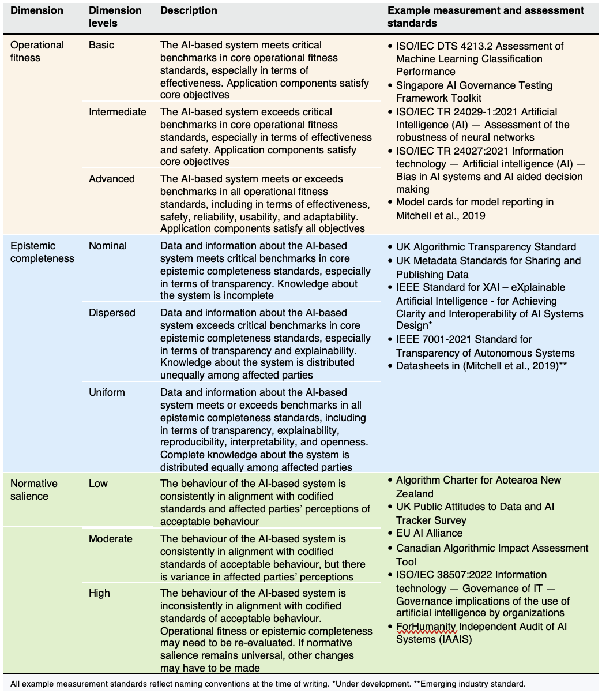
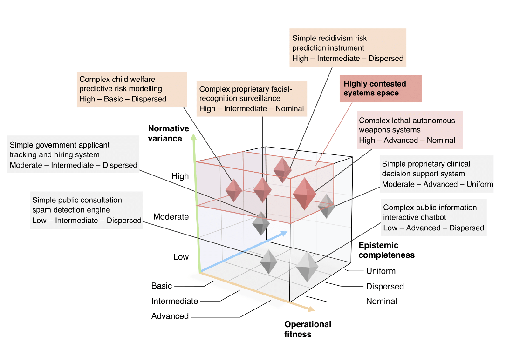

<nav class="toc-fixed" markdown="1">
**Contents**
* TOC
{:toc}
</nav>

This is a companion page for the paper _**Artificial intelligence in government: Concepts, standards, and a unified framework**_ by Vincent Straub, Deborah Morgan, Jonathan Bright, and Helen Margetts. Tables and figures presented below may be downloaded and reused under a Creative Commons Attribution 4.0 International license. The page is best viewed on a desktop device.

## Summary

As artificial intelligence (AI) is adopted by government, we argue that a balanced account is needed to understand the consequences of embedding AI into a public sector context. In this paper, we unify efforts across social and technical disciplines by first conducting an integrative literature review to identify and cluster 69 key terms that frequently co-occur in the multidisciplinary study of AI. We then build on the results of this bibliometric analysis to propose three new multifaceted concepts for understanding and analysing AI-based systems for government (AI-GOV) in a more unified way: (1) operational fitness, (2) epistemic completeness, and (3) normative salience. Finally, we put these concepts to work by using them as dimensions in a conceptual typology of AI-GOV and connecting each with emerging AI technical measurement standards to encourage operationalization, foster cross-disciplinary dialogue, and stimulate debate among those aiming to rethink government with AI.

## Background

Recent advances in artificial intelligence (AI) hold promise to improve government. Key tasks that governments have already been able to use AI for to improve service delivery include detection, prediction, and simulation. Notable applications range from facial-recognition in policing and recidivism prediction in criminal justice, to the use of virtual agents in process automation and forecasting future needs in social services. Yet, as public agencies begin to adopt AI applications, it is critical that these are embedded using standard operational procedures, clear epistemic criteria, and are in alignment with the normative concerns of society.

## Materials and methods 

To identify key concepts in current scholarship on AI in government, a bibliometric approach was employed, which involved retrieving highly cited articles and then extracting relevant concepts from these articles. Specifically, we adopted a three-step study design comprising (i) search term selection, (ii) corpus construction and (iii) concept extraction, illustrated in Figure. 1A.

  

&nbsp;&nbsp;&nbsp;&nbsp;&nbsp;&nbsp;&nbsp;&nbsp;&nbsp;&nbsp;&nbsp;&nbsp;&nbsp;  **Figure 1.** Literature search and concept extraction procedure. (a) Search term selection involved hand selecting seed articles (n=7) on the topic of AI in government and using the keywords (n=12) from these articles as search terms for a literature search. Filtering out articles that did not meet our inclusion criteria resulted in a final corpus of 99 articles from which key concepts were extracted using the unsupervised keyword extraction combined with manual abstract review. (b) The 12 search terms used for the literature search. (b) The top 10 concepts that we extracted. Each bar represents the total number of occurrences of a term in the final list of author-validated extracted concepts. 

This resulted in a sample of 92 articles; when factoring in the seed articles, the final number of articles included in this review is thus 99 articles published in 76 different journals. The complete dataset of articles, extracted concepts and all code to reproduce the results are available in an online repository (see Availability of data and materials statement). 

## Keyword co-occurence

After constructing our final literature corpus and downloading each article, we extracted key concepts by first relying on automatic extraction to detect ‘candidate keywords’ (henceforth also ‘concepts’), i.e., the most important words in each text, and then using manual review for validation (Fig. 1A). We adopted this automatic procedure as a first step to minimize the bias that comes with manual review and to increase the reliability and reproducibility of our research design. In total, automatic extraction resulted in 990 candidate keywords, out of which 69 terms from 87 articles in 69 journals (51 social science and humanities journals, 14 technical venues and 4 interdisciplinary outlets) met our conception definition inclusion criteria. The journals with the most extracted concepts are Government Information Quarterly (number of extracted concepts=5) and Business Horizons (n=5) followed by Nature (n=3) and Science (n=3). 

 **Figure 2.** Concept co-occurrence network graph of scholarship on AI in government. Each concept constitutes a node and the edge weight is determined by their association strength, which normalizes the strength of pairwise co-occurrence by the frequency of each tern. Concepts are grouped into 5 main clusters.  

Turning to the concept co-occurrence clustering results, modularity analysis of the co-occurrence network produced 5 main clusters of concepts (domains), assumed herein to represent distinct subject areas. A distinction can further be made between the three bigger green, purple, and blue clusters (see Fig. 2 for colour reference) that include 86% of all concepts, and the two smaller orange and red clusters that include the remaining 14%. Of the 64 concepts extracted from the corpus of articles that co-occurred with at least 1 other concept, 23 (36%) were grouped into cluster 1 (green), in which two of the bridging terms, ‘public’ and ‘social’, appear the most. While 22 (34%) were grouped into cluster 2 (purple), in which the other two bridging terms ‘intelligence’ and ‘ethical’ predominate, and 10 (16%) are contained in cluster 3 (blue), in which ‘trust’ occurs the most, with a total of 3 occurrences. Finally, cluster 4 (orange) and cluster 5 (red) contain 5 (8%) and 4 (6%) concepts, respectively. The concept ‘analytical’ occurs the most in cluster 4 with a total of 3 occurrences, while the concepts ‘organizational’, ‘performance’, and ‘sociotechnical’ in cluster 5 each occur 2 times.  
  
## New concepts
Based on our mapping of the AI in government field, we contend that a new conceptual framework is needed to integrate the diverse conceptual strands that currently permeate scholarship. Here, we try to do so in the following way: we first propose three new, multi-faceted concepts for studying AI-GOV, before using these to construct a novel conceptual 'typology' of AI-GOV, a method to classify observations in terms of their conceptual attributes. We label the new concepts we introduce **operational fitness**, **epistemic completeness**, and **normative salience**, defined below in Table 1.

&nbsp;&nbsp;&nbsp;&nbsp;&nbsp;&nbsp;&nbsp;&nbsp;&nbsp;&nbsp;&nbsp;&nbsp;&nbsp;  **Table 1.** Proposed dimensions to analyse and classify AI systems in government 

  

Table 2 provides full-length definitions of the scales proposed for each dimension and relates each to emerging measurements standards, recommended metrics and methods for the measurement and evaluation of AI technologies. 

&nbsp;&nbsp;&nbsp;&nbsp;&nbsp;&nbsp;&nbsp;&nbsp;&nbsp;&nbsp;&nbsp;&nbsp;&nbsp;  **Table 2.** Characteristics of proposed dimensions to classify AI-based systems in government 

  

## Typology

Our typology of government AI-based systems is formed of three dimensions (concepts), introduced above: operational fitness, epistemic completeness, and normative variance. In making use of these dimensions, our typology serves two main functions. It is both theory-building in the sense that it
serves to characterize AI-GOV and further explicate the meaning of each dimension, and classificatory, in that it places illustrative examples of different types of AI-GOV in conceptually appropriate cells.

 **Figure 3.** Classifying types of AI-based systems in government. A classification schema places select types of AI-based systems in government along three main axes: normative salience, operational fitness, and epistemic completeness. Systems incorporating complex machine learning models (e.g., neural networks, boosted decision trees, random forests) are contrasted with those using simpler ones (e.g., logistic regression, decision lists). ‘Complex lethal autonomous weapons systems’ are classed as highly contested systems (red box), which exhibit high normative salience and possess advanced operational fitness. A 3-point scale for each dimension is adopted for conceptual parsimony; it is anticipated that future standards for grading real-world systems may use different scales. The draft EU AI Act, for instance, uses a 4-point scale to classify the risk level of an AI system. Where possible, placement of systems is informed by surveys of public attitudes towards AI, otherwise systems are placed using authors’ own interpretation. 

## Terminology 

Since we are pursuing a unified account of AI in government, we follow the definitional path trodden by studies on the potential of AI. We in turn use the term ‘AI system’ broadly to refer to a data-driven, machine-based system that can complete—with some degree of autonomy and learning ability—a specific cognitive task (or set of tasks), using ML, agent computing, or related techniques. Unsurprisingly, many other terms are also used in discussions of AI in government; ‘algorithmic system’ and ‘automated decision system’ feature prominently in policy and legal articles, for instance. We adopt ‘AI system’, as this arguably better distinguishes contemporary systems from earlier generations of computer technology, in terms of their unique, data-powered nature and advanced analytics capabilities. Adopting this definition nevertheless enables us to conduct a conceptual analysis that is not restricted only to existing ML-based applications, although much of the scholarship we cover focuses on this. Moreover, we further employ ‘AI-GOV’ to emphasize that all government AI systems operate within social and institutional contexts.

## Citation
Straub, V. J., Morgan, D., Bright, J., and Margetts, H. (2022). Artificial intelligence in government: Concepts, standards, and a unified framework. arXiv preprint arXiv:2210.17218. DOI: [https://doi.org/10.48550/arXiv.2210.17218](https://doi.org/10.48550/arXiv.2210.17218). 
  
You can also use this [BibTeX entry](https://github.com/vincejstraub/ai-gov-framework/blob/main/CITATION.bib).

## About us
This is a project by Vincent Straub, Deborah Morgan, Jonathan Bright, and Helen Margetts. We are researchers in the Public Policy Programme at the Alan Turing Institute, you can read more about the programme and institute at: [https://www.turing.ac.uk/research/research-programmes/public-policy](https://www.turing.ac.uk/research/research-programmes/public-policy). 

## Contact
Corresponding authors: [vstraub@turing.ac.uk](mailto:vstraub@turing.ac.uk) and [jbright@turing.ac.uk](mailto:jbright@turing.ac.uk).
